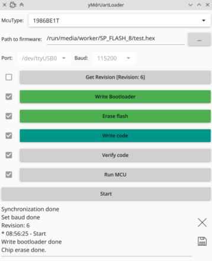

## yMdrUartLoader

Очередная утилита загрузки ПО (прошивок) в микроконтроллеры от Milandr (серия 1986, ядро Arm).

Реализована работа со следующими микроконтроллерами:

- 1986ВЕ1Т
- 1986ВЕ92

Поддерживает работу с hex файлами.

Утилита написана с использованием библиотеки Qt + QML. Проверялась компиляция с Qt версии 5.15.2.

За основу были взяты исходные тексты и hex-файлы загрузчика 1986VE1WSD от vasili.

### Описание интерфейса

Для загрузки ПО необходимо выбрать тип микроконтроллера, файл прошивки, и настройки порта.

Далее нужно выбрать необходимые шаги:

- Get Revision - считывание ревизии МК (актуально для 1986ВЕ1Т). Можно использовать для проверки наличия микроконтроллера.
- Write Bootloder - запись загрузчика в оперативную память и последующий запуск. Шаг обязателен.
- Erase flash - очистка памяти микроконтроллера. Шаг обязателен, если планируется загрузка файла прошивки.
- Write code - загрузка файла прошивки.
- Verify code - верификация (проверка) прошивки загруженной в микроконтроллер.
- Run MCU - запуск микроконтроллера.

Затем нужно нажать кнопку Start. Выбранные шаги будут выполнены по порядку (сверху вниз).

Каждый шаг можно выполнить отдельно, нажав соответствующую кнопку.

### TODO

- добавить список недавних файлов
- реализовать работу с bin файлами
- реализовать считывание прошивки
- хотелось бы реализовать работу на устройствах с Android. Собственно изначально утилита для этого и создавалась, но QSerialPort на Android (во всяком случае без root) пока не работает.

## License

MIT